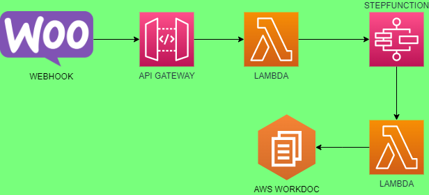

# WooCommerce Webhook API Integration
This repository contains code for integrating a webhook with the WooCommerce API. The code is written in PHP and can be used to receive webhook notifications from WooCommerce when certain events occur.

# Installation
To use this code, you will need to have access to a web server running PHP. You can download the code from this repository and upload it to your web server, or you can clone the repository directly onto your server using Git.

You will also need to configure a webhook in your WooCommerce store to send notifications to the URL where you have uploaded this code. Instructions for setting up a webhook can be found in the WooCommerce documentation.
# Architecture drawing

# Usage
Once you have installed and configured the code, it will automatically receive webhook notifications from your WooCommerce store when certain events occur. The code includes functions for parsing and handling the data received from the webhook, allowing you to take actions such as sending email notifications or updating your database.

To customize the behavior of the code, you can modify the PHP file included in this repository. The file is well-documented and includes comments explaining the purpose of each function.

# Security
It is important to ensure that your webhook integration is secure to prevent unauthorized access to your data. This code includes basic security measures such as input validation and sanitization, but it is recommended to review and customize the code to fit your specific security requirements.

# Contributing
Contributions to this repository are welcome! If you find a bug or would like to suggest an improvement, please create a new issue or submit a pull request.

# License
This code is released under the MIT License. See the LICENSE file for details.

That's a basic template for a README file. Remember to include any specific instructions, dependencies or details relevant to your project. Good luck with your WooCommerce webhook API integration!